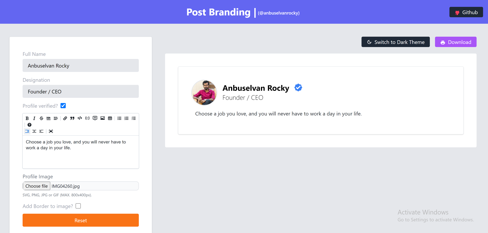

# Post Mockup App 🍨 🎉 [Live](https://cyberdude-post-mockup.vercel.app)

[](https://github.com/anburocky3/post-mockup-app)
[](https://github.com/anburocky3/post-mockup-app)
[](https://github.com/anburocky3/post-mockup-app)

[](https://discord.gg/6ktMR65YMy)
[](https://www.youtube.com/c/cyberdudenetworks)

Create stunning post mockups for your social networks.

#### Screenshots ([🎉👉 Live here](https://cyberdude-post-mockup.vercel.app) )

> #1 - `Simple GUI` that makes the process easier!



> #2 - `Downloaded image` will be like this. You can share it to any platform.


## 🎉 Check it yourself!

| 🚧 Build Status  |                                          |
| ---------------- | :--------------------------------------- |
| ✅ Live Website: | https://cyberdude-post-mockup.vercel.app |

---

### Development

```bash
npm install
npm run dev
```

### Build

To build the App, run

```bash
npm run build
```

And you will see the generated file in `dist` that ready to be served.

### Preview

To preview the build files, run

```bash
npm run preview
```

#### LICENSE: [MIT](./LICENSE)

#### Authors:

- [Anbuselvan Rocky](https://fb.me/anburocky3)
